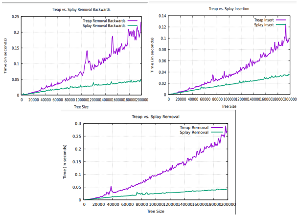

Portfolio
=========

Programming Projects
--------------------

*For access to my private project repositories, please [email me](mailto:amthompson1@csustudent.net?subject=GitHub%20Access) with the subject line, GitHub Access.

---
### [Coffee Inventory Manager (Java) | CSCI 325](project1)

---
### [Balanced Binary Tree Performance Display (C++) | CSCI 315](project2)

---
### [Random Number Guessing Game (Perl) | CSCI 301](project3)

---
### [Shortest Path Algorithm from Input File (C++) | CSCI 415](project1)

---

Ethics Papers
-------------

### [The Horrors of Unreliable Code](/papers/paper1.docx)

-   **Class: CSCI 315 (Data Structures)**  
-   **Grade:**

### [The Ethical Responsibilities of a Professional](/papers/paper2.docx)

-   **Class: CSCI 325 (Object Oriented Programming)** 
-   **Grade:**

### [The Anonymous Privacy of a Society](/papers/paper3.docx)

-   **Class: CSCI 415 (Algorithms)** 
-   **Grade: 100**

---

Presentations
-------------

### [Presentation 1 Title](/pdf/sample_presentation.pdf)

- **Class: CSCI 431 (Operating Systems)** 
- **Grade:**

### [Presentation 2 Title](/pdf/sample_presentation.pdf)

- **Class:** 
- **Grade:**

---

Page template forked from <a href="https://github.com/csu-cs/csci-portfolio">CSU-CS</a>

<!-- Remove above link if you don't want to attributive -->
