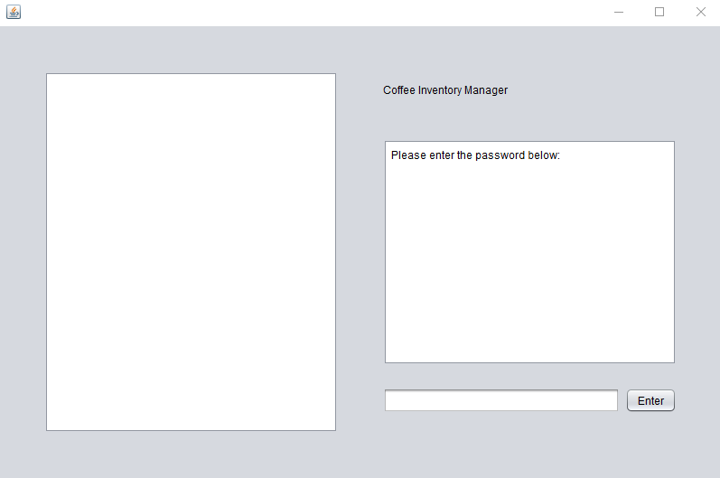
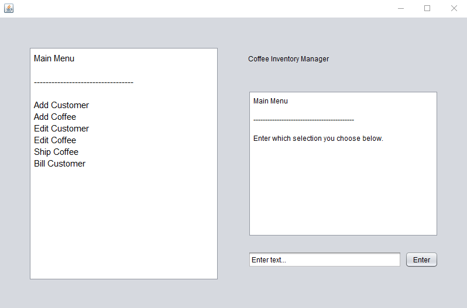
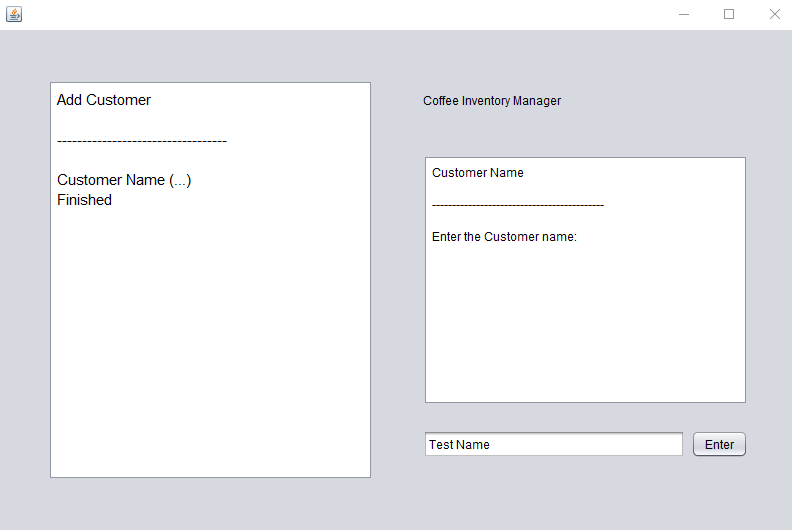
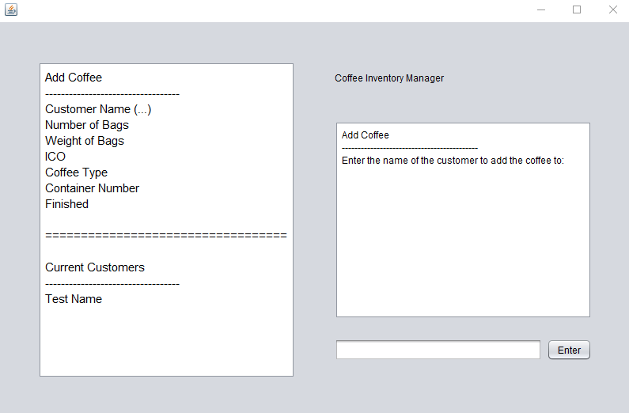
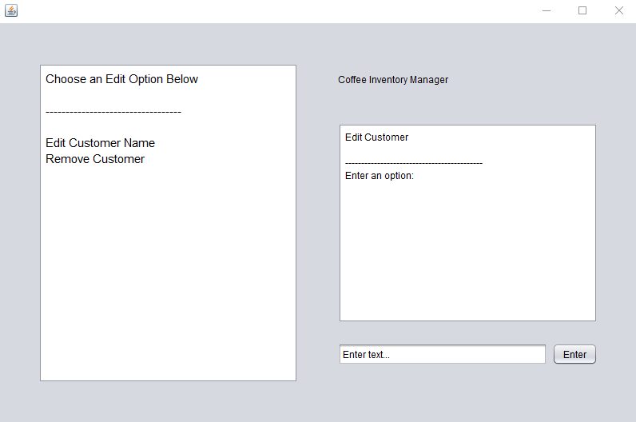
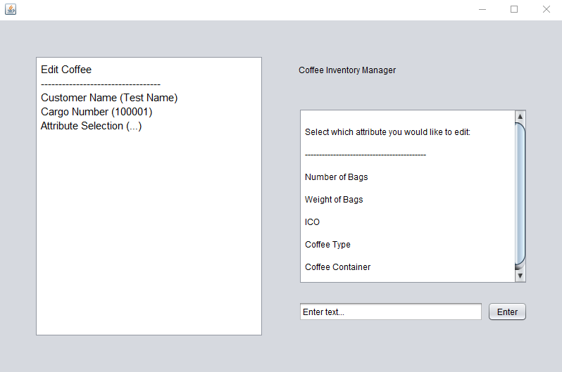
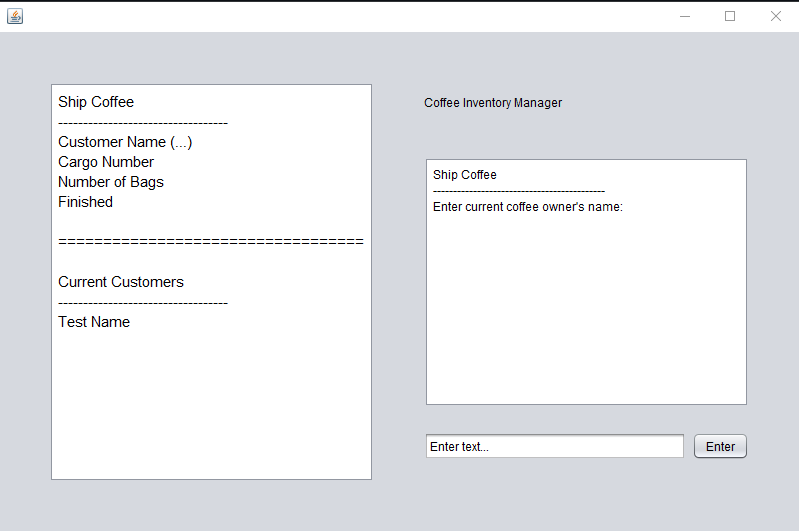
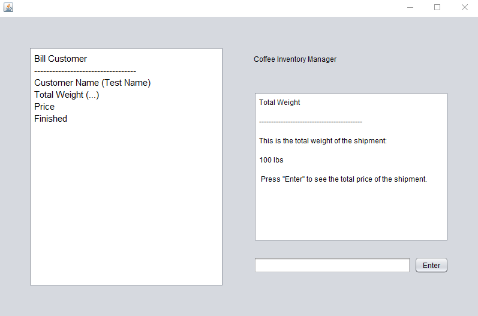
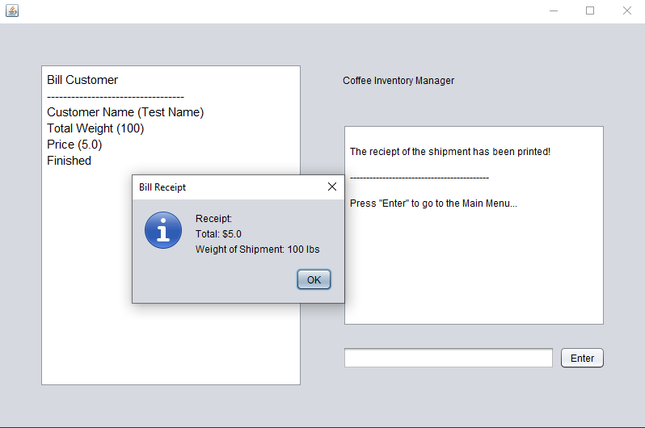

[Back to Portfolio](./)

Coffee Inventory Manager
===============

-   **Class: CSCI 325 (Object Oriented Programming)** 
-   **Grade:** 
-   **Language(s): Java** 
-   **Source Code Repository:** [Link to Respository](https://github.com/AlexThomp1/CoffeeInventoryManager)  
    (Please [email me](mailto:amthompson1@csustudent.net?subject=GitHub%20Access) to request access.)

## Project description

The project involved creating a program with a team using a UI with the Java programming language.
The program created is a "Coffee Inventory Manager", which is a management systems used for coffee inventory warehouses to keep track of coffee types, keep track of customers, and ship/bill customers for the coffee.
This program includes the features of:
- Adding Coffee Types
- Editing Coffee Types
- Removing Coffee Types
- Adding Customers
- Editing Customers
- Removing Customers
- Billing Customers
- Shipping Coffee
- Simple Password Protection for Program

## How to compile and run the program

How to run the program.

```bash
Have the latest Java version installed
Double-click "CoffeeInventoryManager.jar"
```

## UI Design

Almost every program requires user interaction, even command-line programs. Include in this section the tasks the user can complete and what the program does. You don't need to include how it works here; that information may go in the project description or in an additional section, depending on its significance.

The program after launch asks the user to enter a password (see Fig 1.), and once the correct password is entered, a menu of options are displayed (see Fig 2.). The user types one of the options displayed, which is usually done from top to bottom. 
If the user types "Add Customer", they are prompted to enter the customer name (see Fig 3.). If the user types "Add Coffee", they are prompted to enter the customer name (see Fig 4.) and other information asked related to the coffee. 
If the user types "Edit Customer", they are prompted with options to edit the customer's name and remove the customer (see Fig 5.). 
If the user types "Edit Coffee", they are able to choose which attribute of the coffee they want to edit (see Fig 6.). 
If the user types "Ship Coffee", they are able to type the customer name and the coffee type with amount to ship (see Fig 7.). 
If the user types "Bill Customer", they are able to see the details of the coffee they previously shipped (see Fig 8.), and able to "print" the receipt of the shipment (see Fig 9.).

  
Fig 1. The password screen on launch

  
Fig 2. The menu of options the user can type

  
Fig 3. The "Add Customer" option asking for the customer name

  
Fig 4. The "Add Coffee" option asking for the customer name

  
Fig 5. The "Edit Customer" option asking for the user to type "Edit Customer Name" or "Remove Customer"

  
Fig 6. The "Edit Coffee" option showing the avaliable attributes to edit

  
Fig 7. The "Ship Coffee" option asking for the customer name

  
Fig 8. The "Bill Customer" option showing the total weight of the coffee shipment for the customer

  
Fig 9. The "Bill Customer" option giving the receipt of the shipment

## 3. Additional Considerations

This project was a collaborative group project with Alex Thompson, Samuel Shelley, Tanner Hicks, and Kyle Gimple. The parts I was tasked to work on is the Customer class, Edit Customer functionalities, and combining all of the seperate code into a final product.

[Back to Portfolio](./)
