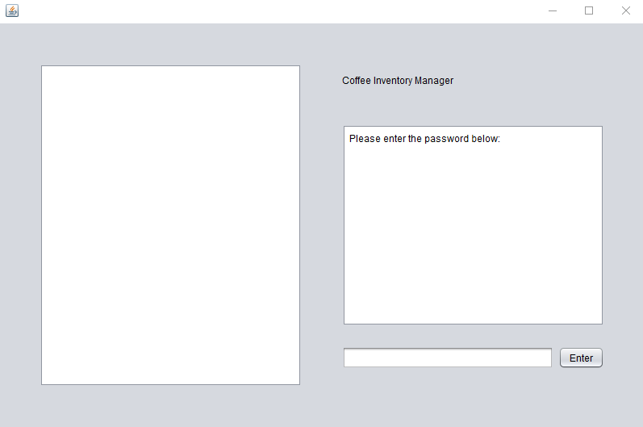
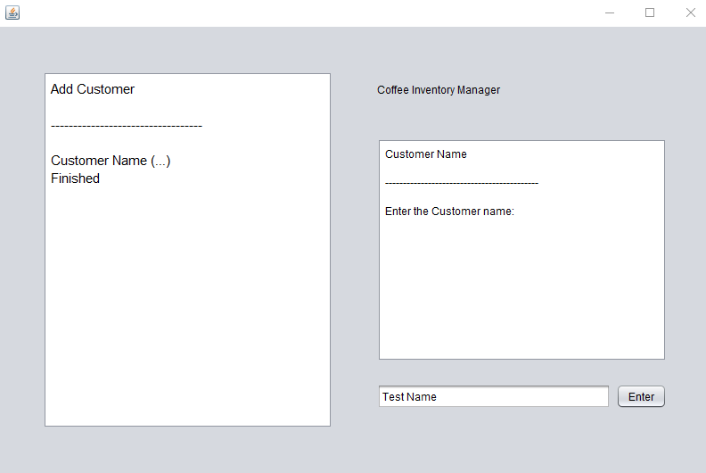

[Back to Portfolio](./)

Balanced Binary Tree Performance Display
===============

-   **Class: CSCI 315 (Data Structures)** 
-   **Grade: 100** 
-   **Language(s): C++** 
-   **Source Code Repository:** [Link to Respository]([https://github.com/AlexThomp1/BalancedBinaryTreeDisplay])  
    (Please [email me](mailto:amthompson1@csustudent.net?subject=GitHub%20Access) to request access.)

## Project description

The project involved creating a program that displays the performance of the algorithms "inserting", "removing in ascending order", and "removing in descending order" of two different Balanced Binary Trees, a Treap and a Splay. 

The program will output a .pdf file that shows two graph lines comparing the time to the size of the tree of each of the algorithms. 

The purpose of the program is to give a visual representation of which tree would be a more efficient balanced binary tree depending on the size of the tree and certain operations needed to be performed.

This program includes the features of:
- Creation of Treap Balanced Binary Tree
- Creation of Splay Balanced Binary Tree
- Different algorithms for each tree to test
- Visual Output of a Performance Comparison to a PDF file

This program is currently compiled for Linux systems only.

## How to compile and run the program

How to run the program (Linux):

Make sure "make" is installed.
```bash
cd BinaryTreeCompare
make
```

## UI Design

Once the makefile is ran, the trees will be created and the algorithms will be ran, while outputting time data to a file located in "data". The process of each generation of data is outputted to the terminal (see Fig 1.).

Once all 6 generations are done, the output PDF files are located in "plots", with the plot data (see Fig 2.).

The PDFs will include both algorithms of the same type for the two trees graphed to be compared visually (see Fig 3.).

  
Fig 1. The password screen on launch

  
Fig 2. The menu of options the user can type

  
Fig 3. The "Add Customer" option asking for the customer name

## 3. Additional Considerations

This program does not have any single executable, but rather needs all the source files together in order to run properly. The program uses "Cross-Desktop Group" to output PDF files once compiled inside of Linux, but is not needed to generate the PDF files.

[Back to Portfolio](./)
