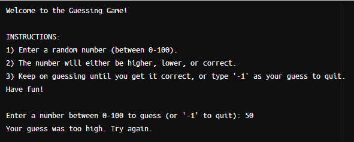

[Back to Portfolio](./)

Random Number Guessing Game
===============

-   **Class: CSCI 301 (Survey of Scripting Languages)** 
-   **Grade: 100** 
-   **Language(s): Perl** 
-   **Source Code Repository:** [Link to Respository](https://github.com/AlexThomp1/BalancedBinaryTreeDisplay)  
    (Please [email me](mailto:amthompson1@csustudent.net?subject=GitHub%20Access) to request access.)

## Project description

The project involved creating a program in Perl that allows the user to guess a random number between 0 and 100. The program will inform the user if their guess is too high, too low, or the correct answer. The user can keep on guessing until they get the correct number, or can type "-1" and will quit the program.

This program includes the features of:
- Number Guessing Game
- User Terminal Input
- Repeat attempts for the same game

## How to run the program

Option 1:

- Install [Perl](https://www.perl.org/get.html).
```bash
perl guessing_game.pl
```

Option 2:
- Use any online Perl compiler ([Like this one](https://www.tutorialspoint.com/execute_perl_online.php))
- Open "guessing_game.pl" through the site or open the file and paste the code into the compiler.
- Execute the code.

## UI Design

The program will welcome the user and give the instructions on how to play the game and use the program. The program will ask the user to input a number between 0 and 100. (see Fig 1.). The user will keep on guessing until the number is correctly guessed.

  
Fig 1. The welcome screen with the instructions when executing the program, and the program asking the user to enter a number.

## 3. Additional Considerations

This program is only a single file. The main purpose of this project is to learn a new scripting language.

[Back to Portfolio](./)
