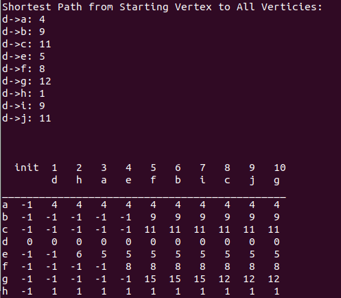

[Back to Portfolio](./)

Shortest Path Algorithm from Input File
===============

-   **Class: CSCI 415 (Algorithms)** 
-   **Grade: 100** 
-   **Language(s): C++** 
-   **Source Code Repository:** [Link to Respository](https://github.com/AlexThomp1/GuessingGamePerl)  
    (Please [email me](mailto:amthompson1@csustudent.net?subject=GitHub%20Access) to request access.)

## Project description

The project involved creating a program that uses a shortest path algorithm (Dijkstra's) to find the shortest path based on the distances given on each edge between vertices. The program uses the "input.txt" file to give input for each vertex, edge, and connecting verticies.

This program includes the features of:
- Shortest Path Algorithm (Dijkstra's)
- Able to change the input file to create any vertex and edge value
- Displays the Adjacency Matrix
- Displays the shortest path from starting and each vertex

## How to run the program (Linux only)
```bash
cd ShortestPath
./shortestpath
```

## UI Design

The program will display the adjacent matrix from the input file. Under the adjacent matrix, the shortest path from the starting vertex to all verticies will be displayed with a table showing the value of each path (see Fig1.).

  
Fig 1. The program displays the shortest path to each vertex and the table of the value of each path.

## 3. Additional Considerations

This program shows the Dijkstra's shortest path algorithm. The user may edit the "input.txt" file to change the number and value of the inputs.

[Back to Portfolio](./)
